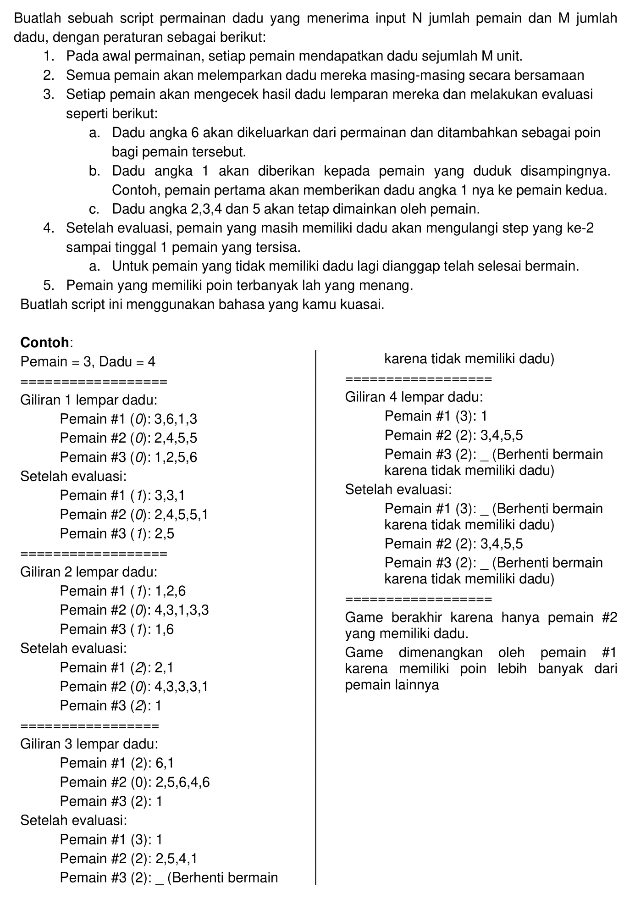
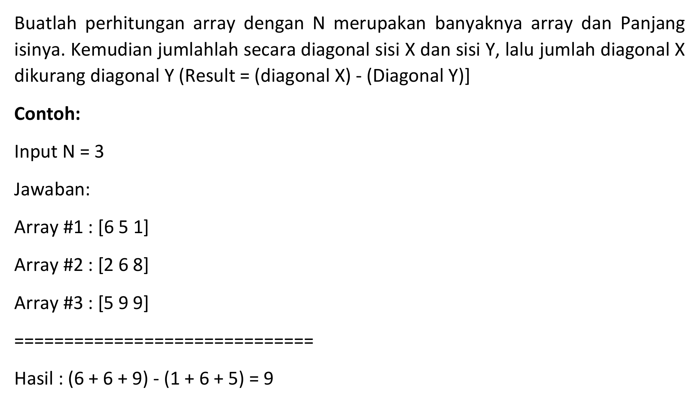

# Logic Test

is a collection of programs in the test logic

# Running Porgram

```bash
    go run main.go --help
```
- ## Dice Game
    

    ### Running dice game
    ```bash
        go run main.go -type=dice-game -players=3 -dices=4
    ```

     ### Information:
      - type the type of program to be run
      - players its the number of players in the dice game.
      - dice is the number of dice in the dice game.


- ## Calculate Square Diagonal
    

    ### Running calculate square diagonal
    ```bash
        go run main.go -type=calculate-square-diagonal -total=3 
    ```

     ### Information:
      - type the type of program to be run
      - total is the number of arrays and their contents

