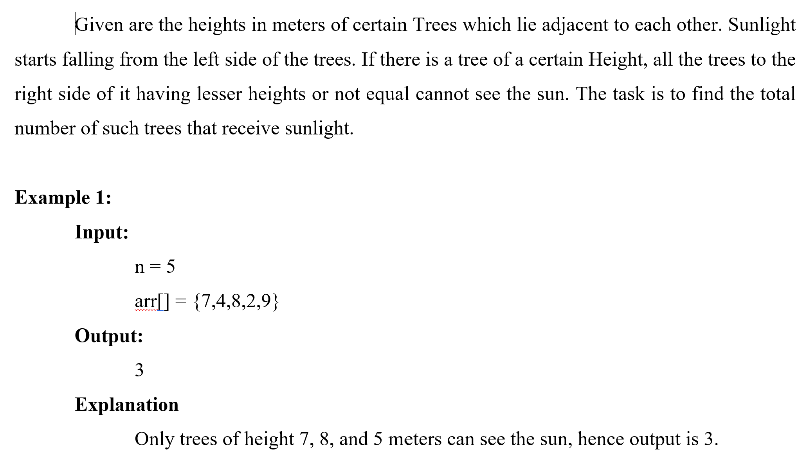

# Logic Test

is a collection of programs in the test logic

# List Program
1. [ Dice Game ](#dice-game)
2. [ Calculate Square Diagonal ](#calculate-square-diagonal)
3. [ Trees And The Sun ](#trees-and-the-sun)
4. [ Min Swap Array ](#min-swap-array)
   
# Running Porgram

```bash
    go run main.go --help
```
- ## Dice Game
    

    ### Running dice game
    ```bash
        go run main.go -type=dice-game -players=3 -dices=4
    ```

     ### Information:
      - type the type of program to be run
      - players its the number of players in the dice game.
      - dice is the number of dice in the dice game.


- ## Calculate Square Diagonal
    

    ### Running calculate square diagonal
    ```bash
        go run main.go -type=calculate-square-diagonal -total=3 
    ```

     ### Information:
      - type the type of program to be run
      - total is the number of arrays and their contents


- ## Trees And The Sun
    

    ### Running trees and the sun
    ```bash
        go run main.go -type=trees-and-the-sun -totalTree=5
    ```

     ### Information:
      - type the type of program to be run
      - totalTree is the number of total tree
  


- ## Min Swap Array
    
    

    ### Running Min Swap Array
    ```bash
        go run main.go -type=min-swap-array
    ```

     ### Information:
      - type the type of program to be run

## 🔗 Links
[](https://github.com/adamnasrudin03)
[](https://www.linkedin.com/in/adam-nasrudin/)
